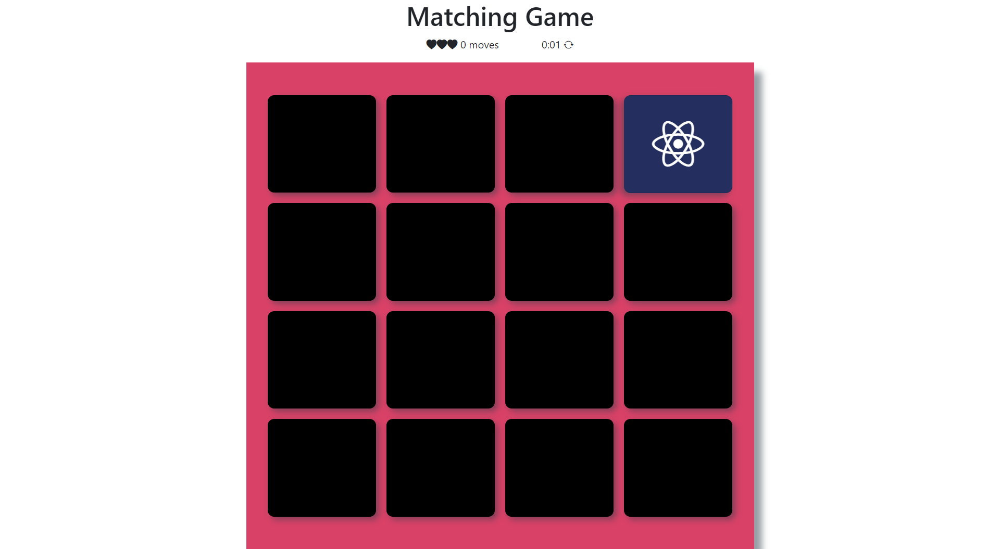
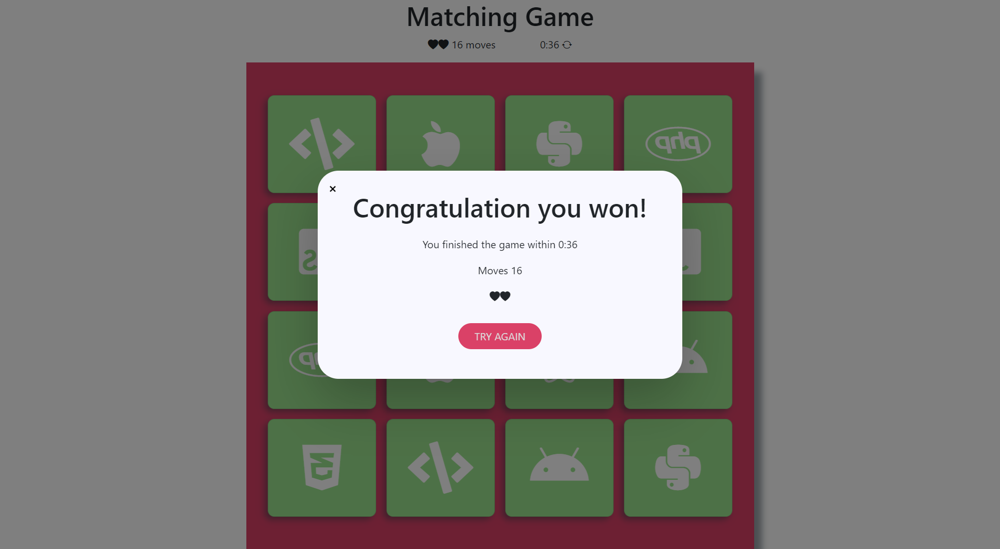

# Memoey-Card-Game-Project-master

Memory Game, also known as the Matching Game, is a simple card game where you need to match pairs by turn 2 cards at a time. 

1. The concept of this game is to collect the most pairs of cards.
2. If the player successfully finds the match cards it will keep them for more play, Otherwise , the cards will be face down again.
3. The trick in this game is to remember the cards.

## Technologies Used
* HTML
* CSS
* JavaScript

# 
# 
